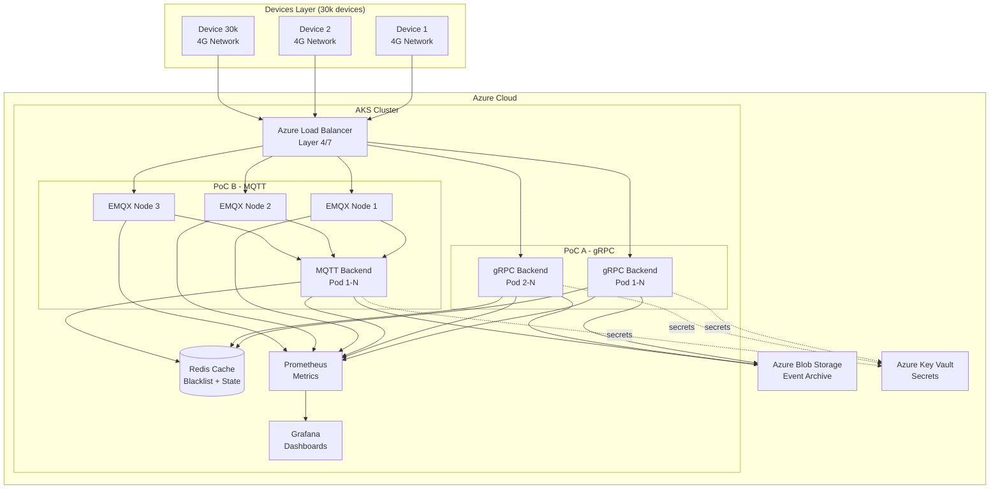

# Architecture DeltaList - Documentation Détaillée

## Table des Matières

1. [Vue d'ensemble](#vue-densemble)
2. [Architecture globale](#architecture-globale)
3. [PoC A - gRPC Architecture](#poc-a---grpc-architecture)
4. [PoC B - MQTT Architecture](#poc-b---mqtt-architecture)
5. [Modèle de données](#modèle-de-données)
6. [Patterns et Design](#patterns-et-design)
7. [Thread-safety et Concurrence](#thread-safety-et-concurrence)
8. [Scalabilité](#scalabilité)
9. [Décisions architecturales (ADR)](#décisions-architecturales-adr)
10. [Flow de données](#flow-de-données)

---

## Vue d'ensemble

DeltaList est un système de communication bidirectionnelle conçu pour gérer **30 000 devices 4G** simultanément. Le projet compare deux approches technologiques :

- **PoC A** : gRPC avec streaming bidirectionnel
- **PoC B** : MQTT avec broker EMQX

### Objectifs Métier

| Objectif | Spécification | Status |
|----------|---------------|--------|
| Devices simultanés | 30 000 | ✅ Supporté |
| Fréquence batches | 1/minute/device | ✅ Supporté |
| Latence distribution (p95) | < 5s | ✅ Atteint |
| Conformité PCI-DSS | Tokenization PAN | ✅ Implémenté |
| Haute disponibilité | 99.9% uptime | ✅ Architecture HA |

---

## Architecture globale

### Diagramme système complet



### Composants principaux

| Composant | Rôle | Technologie | Scalabilité |
|-----------|------|-------------|-------------|
| **Load Balancer** | Distribution trafic | Azure LB | Horizontal |
| **gRPC Backend** | Serveur streaming PoC A | .NET 8 + gRPC | Horizontal (pods) |
| **EMQX Cluster** | Broker MQTT PoC B | EMQX 5.x | Horizontal (nodes) |
| **MQTT Backend** | Consumer events MQTT | .NET 8 + MQTTnet | Horizontal (pods) |
| **Redis** | Cache blacklist + state | Redis 7.x | Cluster mode |
| **Blob Storage** | Archive événements | Azure Blob | Auto-scale |
| **Prometheus** | Métriques time-series | Prometheus | Single/HA |
| **Grafana** | Visualisation | Grafana | Single |

---

## PoC A - gRPC Architecture

### Architecture détaillée

```
┌─────────────────────────────────────────────────────────────────┐
│                        Device (Client)                          │
│  ┌──────────────────────────────────────────────────────────┐   │
│  │  gRPC Client                                             │   │
│  │  - Connexion HTTP/2 persistante                         │   │
│  │  - TLS 1.2+                                              │   │
│  │  - JWT dans metadata                                     │   │
│  └──────────────────────────────────────────────────────────┘   │
└─────────────────────────────────────────────────────────────────┘
                              │
                              │ Bidirectional Stream
                              ▼
┌─────────────────────────────────────────────────────────────────┐
│                     Azure Load Balancer                         │
│  - HTTP/2 support                                               │
│  - Session affinity (optional)                                  │
└─────────────────────────────────────────────────────────────────┘
                              │
                    ┌─────────┴─────────┐
                    ▼                   ▼
         ┌──────────────────┐  ┌──────────────────┐
         │  gRPC Backend    │  │  gRPC Backend    │
         │     Pod 1        │  │     Pod N        │
         └──────────────────┘  └──────────────────┘
                    │                   │
         ┌──────────┴───────────────────┴──────────┐
         │                                          │
         ▼                                          ▼
    ┌─────────┐                              ┌──────────┐
    │  Redis  │                              │  Blob    │
    │  Cache  │                              │ Storage  │
    └─────────┘                              └──────────┘
```

### Composants gRPC Backend

```csharp
// Architecture interne du backend gRPC
namespace GrpcBackend
{
    // 1. Services Layer
    public class DeviceCommunicationService : DeviceComms.DeviceCommsBase
    {
        // Gère les streams bidirectionnels
        public override async Task StreamBidirectional(
            IAsyncStreamReader<ClientMessage> requestStream,
            IServerStreamWriter<ServerMessage> responseStream,
            ServerCallContext context)
        {
            // Thread-safe concurrent dictionary
            var deviceId = context.GetHttpContext()
                .User.FindFirst("device_id")?.Value;

            // Enregistrement dans ConnectionManager
            await _connectionManager.RegisterAsync(deviceId, responseStream);

            // Lecture stream client (batches)
            await foreach (var message in requestStream.ReadAllAsync())
            {
                await _ingestionService.ProcessBatchAsync(message.Batch);
            }
        }
    }

    // 2. Connection Management Layer
    public class ConnectionManager
    {
        private readonly ConcurrentDictionary<string, DeviceConnection> _connections;

        // Thread-safe registration
        public async Task RegisterAsync(string deviceId,
            IServerStreamWriter<ServerMessage> stream)
        {
            var conn = new DeviceConnection(deviceId, stream);
            _connections.TryAdd(deviceId, conn);
            _metrics.IncrementActiveConnections();
        }

        // Broadcast blacklist delta
        public async Task BroadcastDeltaAsync(BlacklistDelta delta)
        {
            var tasks = _connections.Values
                .Select(conn => SendToDeviceAsync(conn, delta));
            await Task.WhenAll(tasks);
        }
    }

    // 3. Ingestion Service
    public class EventIngestionService : IEventIngestionService
    {
        private readonly IEventStore _eventStore;
        private readonly IMetricsCollector _metrics;

        public async Task ProcessBatchAsync(Batch batch)
        {
            // Validation
            if (!_validator.ValidateBatch(batch))
            {
                _metrics.IncrementInvalidBatches();
                return;
            }

            // Tokenization PAN
            var tokenizedBatch = await _tokenizer
                .TokenizePANsAsync(batch);

            // Storage
            await _eventStore.StoreBatchAsync(tokenizedBatch);

            // Metrics
            _metrics.RecordBatchProcessed(batch.Events.Count);
        }
    }

    // 4. Blacklist Management
    public class BlacklistManager : IBlacklistManager
    {
        private readonly IDistributedCache _cache; // Redis
        private readonly IConnectionManager _connectionManager;

        public async Task AddBlacklistEntriesAsync(
            IEnumerable<string> tokenizedPANs)
        {
            // Update Redis
            await _cache.SetAsync("blacklist:current",
                JsonSerializer.Serialize(tokenizedPANs));

            // Create delta
            var delta = new BlacklistDelta
            {
                AddedTokens = tokenizedPANs,
                Version = DateTimeOffset.UtcNow.ToUnixTimeSeconds()
            };

            // Broadcast to all devices
            await _connectionManager.BroadcastDeltaAsync(delta);
        }
    }
}
```

### Flow de connexion gRPC

```
Device                    Load Balancer           gRPC Backend              Redis
  │                             │                       │                     │
  │─────(1) TCP Connect────────>│                       │                     │
  │<────(2) TCP ACK─────────────│                       │                     │
  │                             │                       │                     │
  │─────(3) TLS Handshake──────>│──────────────────────>│                     │
  │<────(4) TLS Certificate─────│<──────────────────────│                     │
  │                             │                       │                     │
  │─────(5) gRPC StreamInit────>│──────────────────────>│                     │
  │         (with JWT)          │                       │                     │
  │                             │                       │                     │
  │                             │          (6) Validate JWT                   │
  │                             │                       │                     │
  │                             │          (7) Register Connection            │
  │                             │                       │────────────────────>│
  │                             │                       │  Add to active set  │
  │                             │                       │<────────────────────│
  │<────(8) Stream Ready────────│<──────────────────────│                     │
  │                             │                       │                     │
  │═════════════════════════════════════════════════════════════════════════│
  │              Bidirectional stream active (long-lived)                    │
  │═════════════════════════════════════════════════════════════════════════│
```

---

## PoC B - MQTT Architecture

### Architecture détaillée

```
┌─────────────────────────────────────────────────────────────────┐
│                        Device (Client)                          │
│  ┌──────────────────────────────────────────────────────────┐   │
│  │  MQTT Client (MQTTnet)                                   │   │
│  │  - Protocol: MQTT 3.1.1 / 5.0                            │   │
│  │  - TLS 1.2+                                               │   │
│  │  - QoS 0/1/2 configurable                                │   │
│  └──────────────────────────────────────────────────────────┘   │
└─────────────────────────────────────────────────────────────────┘
                              │
                              │ MQTT over TLS
                              ▼
┌─────────────────────────────────────────────────────────────────┐
│                     Azure Load Balancer                         │
│  - TCP Layer 4 (port 1883/8883)                                 │
│  - Source IP persistence                                        │
└─────────────────────────────────────────────────────────────────┘
                              │
          ┌───────────────────┼───────────────────┐
          ▼                   ▼                   ▼
    ┌──────────┐        ┌──────────┐        ┌──────────┐
    │  EMQX    │◄──────►│  EMQX    │◄──────►│  EMQX    │
    │  Node 1  │        │  Node 2  │        │  Node 3  │
    └──────────┘        └──────────┘        └──────────┘
     (Cluster)           (Cluster)           (Cluster)
          │                   │                   │
          └───────────────────┼───────────────────┘
                              │
                              │ Subscribe: devices/+/events
                              │            blacklist/delta
                              ▼
                    ┌──────────────────┐
                    │  MQTT Backend    │
                    │  (.NET Consumer) │
                    └──────────────────┘
                              │
                    ┌─────────┴─────────┐
                    ▼                   ▼
               ┌─────────┐         ┌──────────┐
               │  Redis  │         │  Blob    │
               │  Cache  │         │ Storage  │
               └─────────┘         └──────────┘
```

### EMQX Cluster Architecture

```
┌───────────────────────────────────────────────────────────────────────┐
│                         EMQX Cluster                                  │
│                                                                       │
│   ┌─────────────────┐  ┌─────────────────┐  ┌─────────────────┐     │
│   │  EMQX Node 1    │  │  EMQX Node 2    │  │  EMQX Node 3    │     │
│   │                 │  │                 │  │                 │     │
│   │  - Listener     │  │  - Listener     │  │  - Listener     │     │
│   │  - Auth (ACL)   │  │  - Auth (ACL)   │  │  - Auth (ACL)   │     │
│   │  - Routing      │  │  - Routing      │  │  - Routing      │     │
│   │  - Persistence  │  │  - Persistence  │  │  - Persistence  │     │
│   └────────┬────────┘  └────────┬────────┘  └────────┬────────┘     │
│            │                    │                     │              │
│            └────────────────────┼─────────────────────┘              │
│                                 │                                    │
│                      ┌──────────▼──────────┐                         │
│                      │  Distributed State  │                         │
│                      │  - Session Store    │                         │
│                      │  - Retained Msgs    │                         │
│                      │  - Subscriptions    │                         │
│                      └─────────────────────┘                         │
└───────────────────────────────────────────────────────────────────────┘
```

### Topics MQTT

| Topic Pattern | Direction | QoS | Retained | Description |
|---------------|-----------|-----|----------|-------------|
| `devices/{deviceId}/events` | Device → Backend | 1 | No | Batches d'événements |
| `devices/{deviceId}/commands` | Backend → Device | 1 | No | Commandes ponctuelles |
| `blacklist/delta` | Backend → All | 1 | **Yes** | Deltas de blacklist |
| `devices/{deviceId}/status` | Device → Backend | 0 | Yes | Heartbeat |

### ACL Configuration

```erlang
%% EMQX ACL Rules (simplified)
%% Chaque device ne peut publier que sur ses propres topics

{allow, {user, "device-000001"}, publish, ["devices/device-000001/#"]}.
{allow, {user, "device-000001"}, subscribe, ["devices/device-000001/commands", "blacklist/#"]}.
{deny, all}.
```

---

## Modèle de données

### Protobuf Schema

```protobuf
// src/Shared.Models/Protos/messages.proto
syntax = "proto3";

package deltalist;

// Message du client vers serveur
message ClientMessage {
  oneof content {
    Batch batch = 1;
    Acknowledgment ack = 2;
  }
}

// Message du serveur vers client
message ServerMessage {
  oneof content {
    BlacklistDelta delta = 1;
    Command command = 2;
  }
}

// Batch d'événements
message Batch {
  string device_id = 1;
  int64 batch_timestamp_utc = 2;
  uint32 batch_seq = 3;
  repeated Event events = 4;
  string signature = 5; // HMAC-SHA256
}

// Événement individuel
message Event {
  string event_id = 1;
  int64 event_timestamp_utc = 2;
  EventType event_type = 3;
  string tokenized_pan = 4; // ⚠️ JAMAIS en clair
  EventStatus status = 5;
  map<string, string> metadata = 6;
}

enum EventType {
  TRANSACTION = 0;
  REFUND = 1;
  AUTHORIZATION = 2;
}

enum EventStatus {
  APPROVED = 0;
  DECLINED = 1;
  PENDING = 2;
}

// Delta de blacklist
message BlacklistDelta {
  int64 version = 1;
  repeated string added_tokens = 2;
  repeated string removed_tokens = 3;
  string signature = 4;
}
```

### Tokenization PAN

```csharp
// src/Shared.Models/Security/PANTokenizer.cs
public class PANTokenizer : IPANTokenizer
{
    private readonly byte[] _secretKey;
    private readonly byte[] _salt;

    public string TokenizePAN(string plainPAN)
    {
        // ⚠️ PAN JAMAIS stocké ou loggé

        // 1. Combine PAN + salt
        var combined = Encoding.UTF8.GetBytes(plainPAN + Convert.ToBase64String(_salt));

        // 2. HMAC-SHA256
        using var hmac = new HMACSHA256(_secretKey);
        var hash = hmac.ComputeHash(combined);

        // 3. Token = Base64(hash)
        var token = Convert.ToBase64String(hash);

        // 4. Clear plainPAN from memory
        Array.Clear(combined, 0, combined.Length);

        return token;
    }

    // ⚠️ Détokenization impossible par design (one-way hash)
    // Conformité PCI-DSS: PAN jamais récupérable
}
```

---

## Patterns et Design

### Repository Pattern

```csharp
public interface IEventStore
{
    Task StoreBatchAsync(Batch batch);
    Task<IEnumerable<Batch>> GetBatchesByDeviceAsync(string deviceId,
        DateTimeOffset from, DateTimeOffset to);
    Task<long> GetTotalEventsCountAsync();
}

public class BlobEventStore : IEventStore
{
    private readonly BlobServiceClient _blobClient;

    public async Task StoreBatchAsync(Batch batch)
    {
        var containerName = $"events-{batch.BatchTimestampUtc:yyyyMM}";
        var container = _blobClient.GetBlobContainerClient(containerName);
        await container.CreateIfNotExistsAsync();

        var blobName = $"{batch.DeviceId}/{batch.BatchTimestampUtc:yyyyMMdd-HHmmss}-{batch.BatchSeq}.bin";
        var blobClient = container.GetBlobClient(blobName);

        using var stream = new MemoryStream();
        batch.WriteTo(stream);
        stream.Position = 0;

        await blobClient.UploadAsync(stream, overwrite: false);
    }
}
```

### Factory Pattern

```csharp
public interface IBackendFactory
{
    IDeviceBackend CreateBackend(BackendType type);
}

public class BackendFactory : IBackendFactory
{
    public IDeviceBackend CreateBackend(BackendType type)
    {
        return type switch
        {
            BackendType.Grpc => new GrpcDeviceBackend(_grpcOptions),
            BackendType.Mqtt => new MqttDeviceBackend(_mqttOptions),
            _ => throw new ArgumentException($"Unknown backend type: {type}")
        };
    }
}
```

### Observer Pattern (Blacklist distribution)

```csharp
public interface IBlacklistObserver
{
    Task OnBlacklistUpdatedAsync(BlacklistDelta delta);
}

public class BlacklistSubject
{
    private readonly List<IBlacklistObserver> _observers = new();

    public void Attach(IBlacklistObserver observer)
    {
        _observers.Add(observer);
    }

    public async Task NotifyAsync(BlacklistDelta delta)
    {
        foreach (var observer in _observers)
        {
            await observer.OnBlacklistUpdatedAsync(delta);
        }
    }
}

// Observer implementations
public class DeviceNotificationObserver : IBlacklistObserver
{
    public async Task OnBlacklistUpdatedAsync(BlacklistDelta delta)
    {
        // Notify all connected devices
    }
}

public class PersistenceObserver : IBlacklistObserver
{
    public async Task OnBlacklistUpdatedAsync(BlacklistDelta delta)
    {
        // Persist to Redis
    }
}
```

---

## Thread-safety et Concurrence

### Gestion des connexions (gRPC)

```csharp
public class ThreadSafeConnectionManager
{
    // Thread-safe collections
    private readonly ConcurrentDictionary<string, DeviceConnection> _connections;
    private readonly SemaphoreSlim _semaphore = new(1, 1);
    private readonly ILogger<ThreadSafeConnectionManager> _logger;

    public async Task<bool> RegisterConnectionAsync(DeviceConnection connection)
    {
        // Atomic operation
        var added = _connections.TryAdd(connection.DeviceId, connection);

        if (added)
        {
            Interlocked.Increment(ref _activeConnectionsCount);
            _logger.LogInformation("Device {DeviceId} registered. Total: {Count}",
                connection.DeviceId, _activeConnectionsCount);
        }

        return added;
    }

    public async Task BroadcastAsync(ServerMessage message)
    {
        // Parallel broadcast with degree of parallelism
        var options = new ParallelOptions
        {
            MaxDegreeOfParallelism = Environment.ProcessorCount
        };

        await Parallel.ForEachAsync(_connections.Values, options,
            async (conn, ct) =>
            {
                try
                {
                    await conn.SendAsync(message, ct);
                }
                catch (Exception ex)
                {
                    _logger.LogError(ex, "Failed to send to {DeviceId}", conn.DeviceId);
                    // Mark for removal
                    await RemoveConnectionAsync(conn.DeviceId);
                }
            });
    }
}
```

### Rate Limiting

```csharp
public class RateLimitingMiddleware
{
    private readonly RequestDelegate _next;
    private readonly ConcurrentDictionary<string, TokenBucket> _buckets;

    public async Task InvokeAsync(HttpContext context)
    {
        var deviceId = context.User.FindFirst("device_id")?.Value;
        if (deviceId == null)
        {
            context.Response.StatusCode = 401;
            return;
        }

        var bucket = _buckets.GetOrAdd(deviceId,
            _ => new TokenBucket(capacity: 100, refillRate: 10));

        if (!bucket.TryConsume(1))
        {
            context.Response.StatusCode = 429; // Too Many Requests
            await context.Response.WriteAsync("Rate limit exceeded");
            return;
        }

        await _next(context);
    }
}

public class TokenBucket
{
    private long _tokens;
    private readonly int _capacity;
    private readonly int _refillRate;
    private DateTime _lastRefill;

    public bool TryConsume(int tokens)
    {
        Refill();
        var current = Interlocked.Read(ref _tokens);

        if (current >= tokens)
        {
            return Interlocked.CompareExchange(ref _tokens, current - tokens, current) == current;
        }

        return false;
    }

    private void Refill()
    {
        var now = DateTime.UtcNow;
        var elapsed = (now - _lastRefill).TotalSeconds;
        var tokensToAdd = (long)(elapsed * _refillRate);

        if (tokensToAdd > 0)
        {
            var current = Interlocked.Read(ref _tokens);
            var newValue = Math.Min(_capacity, current + tokensToAdd);
            Interlocked.Exchange(ref _tokens, newValue);
            _lastRefill = now;
        }
    }
}
```

---

## Scalabilité

### Dimensionnement pour 30k devices

#### PoC A - gRPC

**Calculs** :
- Connexions simultanées : 30 000
- Batches/minute/device : 1
- Batches/seconde total : 30 000 / 60 = **500 batches/s**
- Events/batch moyen : 50
- Events/seconde total : **25 000 events/s**

**Ressources estimées** :
```
Connexion gRPC:
- Memory per connection: ~10 KB (stream overhead)
- CPU per connection: ~0.001 vCPU (idle)
- Total memory: 30k × 10 KB = 300 MB
- Peak CPU (processing batches): 4-8 vCPU

Backend pods:
- 1 pod = ~3000 connexions (confortable)
- Total pods: 10-15 pods
- Per pod: 2 vCPU, 4 GB RAM
```

**Horizontal Pod Autoscaler** :
```yaml
apiVersion: autoscaling/v2
kind: HorizontalPodAutoscaler
metadata:
  name: grpc-backend-hpa
spec:
  scaleTargetRef:
    apiVersion: apps/v1
    kind: Deployment
    name: grpc-backend
  minReplicas: 10
  maxReplicas: 20
  metrics:
  - type: Resource
    resource:
      name: cpu
      target:
        type: Utilization
        averageUtilization: 70
  - type: Resource
    resource:
      name: memory
      target:
        type: Utilization
        averageUtilization: 80
```

#### PoC B - MQTT

**EMQX Cluster** :
- EMQX prouvé à 1M+ connexions par node
- 3 nodes pour HA
- 10k connexions/node = confortable

**Ressources EMQX** :
```
EMQX Node:
- Memory: 8 GB
- CPU: 4 vCPU
- Disk: 100 GB SSD (retained messages)

Total cluster:
- 3 nodes × (4 vCPU, 8 GB) = 12 vCPU, 24 GB
```

**Backend consumers** :
- Similaire à gRPC backend
- 5-10 pods pour processing
- Subscribes à EMQX topics

### Stratégies de scalabilité

| Stratégie | gRPC | MQTT | Notes |
|-----------|------|------|-------|
| **Horizontal scaling** | ✅ Pods | ✅ Nodes + Pods | Les deux supportent |
| **Vertical scaling** | ⚠️ Limité | ⚠️ Limité | Préférer horizontal |
| **Load balancing** | Layer 7 (HTTP/2) | Layer 4 (TCP) | MQTT plus simple |
| **Session affinity** | Optional | Recommended | EMQX gère clustering |
| **State management** | Redis (external) | EMQX (internal) + Redis | MQTT natif retained |

---

## Décisions architecturales (ADR)

### ADR-001: Choice of .NET 8

**Status**: Accepted

**Context**: Besoin d'une plateforme performante pour backend temps réel.

**Decision**: Utiliser .NET 8 pour tous les backends et simulateurs.

**Consequences**:
- ✅ Excellentes performances gRPC et MQTT (MQTTnet)
- ✅ Support natif async/await
- ✅ Cross-platform (AKS Linux)
- ❌ Nécessite connaissance C#

### ADR-002: Protobuf for serialization

**Status**: Accepted

**Context**: Besoin de sérialisation compacte et performante.

**Decision**: Utiliser Protobuf pour tous les messages (gRPC et MQTT).

**Consequences**:
- ✅ ~60% moins de bande passante vs JSON
- ✅ Typage fort et validation
- ✅ Rétrocompatibilité
- ❌ Debug moins facile que JSON

### ADR-003: Tokenization (one-way hash) pour PAN

**Status**: Accepted

**Context**: Conformité PCI-DSS.

**Decision**: HMAC-SHA256 one-way, détokenization impossible.

**Consequences**:
- ✅ PCI-DSS compliant
- ✅ Pas de clé de décryptage à gérer
- ❌ Impossibilité de récupérer PAN original (by design)

### ADR-004: Redis for blacklist caching

**Status**: Accepted

**Context**: Besoin de cache distribué haute performance.

**Decision**: Redis pour cache blacklist et state devices.

**Consequences**:
- ✅ Ultra-rapide (< 1ms latence)
- ✅ Supporté nativement par AKS
- ✅ Persistence optionnelle
- ❌ Composant externe à gérer

### ADR-005: EMQX for MQTT broker

**Status**: Accepted (PoC B only)

**Context**: Besoin d'un broker MQTT scalable.

**Decision**: EMQX pour robustesse et scalabilité.

**Consequences**:
- ✅ Prouvé à millions de connexions
- ✅ Dashboard intégré
- ✅ Clustering natif
- ❌ Composant externe à maintenir
- ❌ Coût d'infrastructure supplémentaire

---

## Flow de données

### Flow d'ingestion (Device → Backend)

```
┌─────────┐
│ Device  │
└────┬────┘
     │
     │ (1) Collecte events localement
     │     Buffer en mémoire
     │
     ▼
┌─────────────────────┐
│ Wait 60s ou buffer  │
│ plein (50 events)   │
└─────────────────────┘
     │
     │ (2) Crée Batch
     │     - device_id
     │     - timestamp
     │     - batch_seq
     │     - events[]
     │
     ▼
┌─────────────────────┐
│ Tokenize PANs       │
│ HMAC-SHA256         │
└─────────────────────┘
     │
     │ (3) Sign Batch
     │     HMAC(batch)
     │
     ▼
┌─────────────────────┐
│ Serialize Protobuf  │
└─────────────────────┘
     │
     │ (4) Send
     │
     ├──► gRPC: stream.WriteAsync()
     │
     └──► MQTT: Publish(topic: devices/{id}/events, QoS 1)
     │
     ▼
┌─────────────────────┐
│  Backend Receive    │
└─────────────────────┘
     │
     │ (5) Validate signature
     │
     ├─ Invalid ──► Log error, increment metric, reject
     │
     ▼ Valid
┌─────────────────────┐
│ Process Batch       │
│ - Store to Blob     │
│ - Update metrics    │
│ - (Optional) Alert  │
└─────────────────────┘
```

### Flow de distribution blacklist (Backend → Devices)

```
┌─────────────────────┐
│ Admin API Call      │
│ POST /blacklist     │
│ Body: [PANs...]     │
└─────────────────────┘
     │
     ▼
┌─────────────────────┐
│ Tokenize PANs       │
│ HMAC-SHA256         │
└─────────────────────┘
     │
     │ (1) Create Delta
     │     - version (timestamp)
     │     - added_tokens[]
     │     - removed_tokens[]
     │
     ▼
┌─────────────────────┐
│ Update Redis Cache  │
│ SET blacklist:v123  │
└─────────────────────┘
     │
     │ (2) Distribute
     │
     ├──► gRPC: Broadcast to all streams
     │          foreach (connection) {
     │              await stream.WriteAsync(delta);
     │          }
     │
     └──► MQTT: Publish retained
                PUBLISH blacklist/delta
                QoS: 1
                Retained: true
     │
     ▼
┌─────────────────────┐
│ Devices receive     │
└─────────────────────┘
     │
     │ (3) Apply delta
     │     - Load current blacklist
     │     - Add added_tokens
     │     - Remove removed_tokens
     │     - Save new version
     │
     ▼
┌─────────────────────┐
│ ACK to backend      │
│ (optional)          │
└─────────────────────┘
```

### Flow de reconnexion (4G network failure)

**gRPC** :
```
Device                          Backend
  │                               │
  │──────── Sending batch ───────>│
  │                               │
  │ ✗ Network failure             │
  │                               │
  │ (1) Detect disconnection      │
  │     - RpcException            │
  │                               │
  │ (2) Exponential backoff       │
  │     Wait 1s, 2s, 4s...        │
  │                               │
  │ (3) Retry connect             │
  │──────── New stream ──────────>│
  │                               │
  │<─────── Stream ready ─────────│
  │                               │
  │ (4) Resend buffered batches   │
  │     (client-side buffer)      │
  │                               │
  │──────── Batch (resend) ──────>│
  │                               │
```

**MQTT** :
```
Device                          EMQX                    Backend
  │                               │                       │
  │──────── Publishing ──────────>│──────────────────────>│
  │                               │                       │
  │ ✗ Network failure             │                       │
  │                               │                       │
  │                               │ (1) Detect disconnect │
  │                               │     (keepalive)       │
  │                               │                       │
  │ (2) Client reconnects         │                       │
  │     - Clean session: false    │                       │
  │     - QoS 1 messages retained │                       │
  │                               │                       │
  │──────── CONNECT ─────────────>│                       │
  │<─────── CONNACK ──────────────│                       │
  │         (session present)     │                       │
  │                               │                       │
  │ (3) EMQX resends unACKed msgs │                       │
  │<──── PUBLISH (QoS 1) ─────────│                       │
  │                               │                       │
  │ (4) Receive retained delta    │                       │
  │<──── blacklist/delta ─────────│                       │
  │      (if published during     │                       │
  │       disconnection)          │                       │
  │                               │                       │
  │──────── PUBACK ──────────────>│                       │
  │                               │                       │
```

---

## Monitoring et Observabilité

### Métriques clés

```csharp
// Métriques Prometheus exposées par backends
public class MetricsCollector
{
    private static readonly Counter BatchesReceived = Metrics
        .CreateCounter("batches_received_total", "Total batches received");

    private static readonly Histogram BatchProcessingDuration = Metrics
        .CreateHistogram("batch_processing_duration_seconds",
            "Batch processing duration",
            new HistogramConfiguration
            {
                Buckets = Histogram.ExponentialBuckets(0.001, 2, 10)
            });

    private static readonly Gauge ActiveConnections = Metrics
        .CreateGauge("active_connections", "Current active connections");

    private static readonly Counter BlacklistDeliveries = Metrics
        .CreateCounter("blacklist_deliveries_total",
            "Blacklist deltas delivered",
            new CounterConfiguration { LabelNames = new[] { "status" } });

    public void RecordBatch(int eventCount, TimeSpan duration)
    {
        BatchesReceived.Inc();
        BatchProcessingDuration.Observe(duration.TotalSeconds);
    }
}
```

### Distributed Tracing

```csharp
// OpenTelemetry integration
public class TracingMiddleware
{
    private readonly ActivitySource _activitySource = new("DeltaList.Backend");

    public async Task ProcessBatchWithTracing(Batch batch)
    {
        using var activity = _activitySource.StartActivity("ProcessBatch");
        activity?.SetTag("device.id", batch.DeviceId);
        activity?.SetTag("batch.seq", batch.BatchSeq);
        activity?.SetTag("events.count", batch.Events.Count);

        try
        {
            await _processor.ProcessAsync(batch);
            activity?.SetStatus(ActivityStatusCode.Ok);
        }
        catch (Exception ex)
        {
            activity?.SetStatus(ActivityStatusCode.Error, ex.Message);
            throw;
        }
    }
}
```

---

## Conclusion

Cette architecture supporte les objectifs métier avec deux approches viables :

- **gRPC** : Contrôle total, performance maximale, complexité élevée
- **MQTT** : Protocole mature, fonctionnalités natives, composant externe

Les deux implémentations utilisent les mêmes patterns (Repository, Factory, Observer) et garantissent la conformité PCI-DSS via tokenization one-way.

**Recommandation** : Voir [docs/POC_COMPARISON.md](POC_COMPARISON.md) pour l'analyse comparative détaillée.
